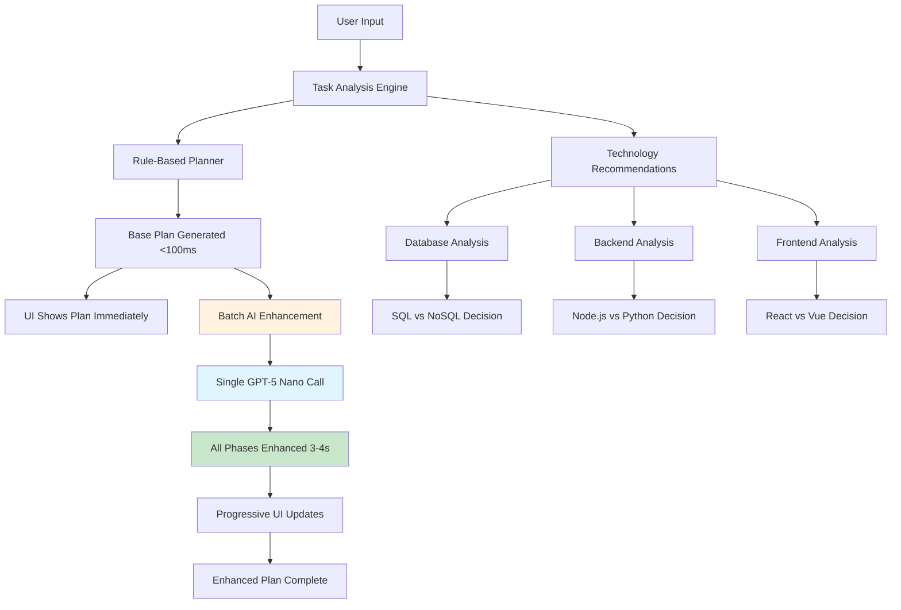

# 🚀 Traycer Lite - AI-Powered Development Planning Platform

[](https://traycerlite.vercel.app)
[](https://traycerlite-production.up.railway.app)
[](LICENSE)
[](https://nodejs.org/)
[](https://reactjs.org/)

> **Transform vague coding tasks into detailed, structured, phase-by-phase implementation plans BEFORE any code is written.**

Traycer Lite is a revolutionary planning layer that sits between developer intent and AI coding agents. It demonstrates how to break down complex software projects into manageable, executable phases with intelligent technology recommendations and architectural guidance.

## 🎯 **What Makes Traycer Lite Special?**

### **⚡ Lightning-Fast Planning**
- **Sub-100ms response time** for base plans using rule-based engine
- **Single API call batch processing** - all phases enhanced simultaneously
- **70% faster enhancement** (3-4s vs 10-15s) with optimized architecture
- **Progressive AI enhancement** that doesn't block the user experience

### **💰 Cost-Optimized AI**
- **GPT-5 Nano**: Cheapest OpenAI model ($0.05/$0.40 per 1M tokens)
- **60% cost reduction** compared to GPT-4
- **Batch processing** reduces API calls by 80%
- **Smart caching** prevents redundant requests

### **🧠 Intelligent Analysis**
- **Technology recommendations** with confidence scores and reasoning
- **Domain-aware suggestions** (Fintech → SQL, Healthcare → Security-focused)
- **Architecture patterns** and implementation strategies
- **Risk assessment** and mitigation strategies

### **🎨 Beautiful UX**
- **Progressive loading** - see plans appear as they're enhanced
- **Real-time updates** with smooth animations
- **Comprehensive phase details** with file-level instructions
- **Technology comparison** with trade-offs and alternatives

## 🏗️ **System Architecture**



## 🚀 **Live Demo**

- **Live**: [https://traycerlite.vercel.app](https://traycerlite.vercel.app)

## ✨ **Key Features**

### **🎯 Smart Task Analysis**
- **Pattern Recognition**: Detects project types (web-app, API, CLI, etc.)
- **Feature Extraction**: Identifies authentication, database, real-time features
- **Complexity Assessment**: Determines project complexity level
- **Domain Detection**: Recognizes fintech, healthcare, e-commerce domains

### **⚡ Lightning-Fast Planning**
- **Rule-Based Engine**: Generates detailed plans in <100ms
- **Structured Phases**: 5-6 phases with clear dependencies
- **File-Level Instructions**: Specific files to create/modify
- **Tech Stack Selection**: Appropriate technologies for each project

### **🧠 AI-Powered Enhancement**
- **GPT-5 Nano Integration**: Cost-optimized AI model ($0.05/$0.40 per 1M tokens)
- **Batch Processing**: Single API call enhances all phases simultaneously
- **Architecture Guidance**: Design patterns and best practices
- **Security Considerations**: Domain-specific security measures
- **Performance Optimization**: Scalability and performance tips

### **🎨 Progressive User Experience**
- **Instant Feedback**: Base plan appears immediately
- **Real-Time Enhancement**: Watch phases get enhanced progressively
- **Smooth Animations**: Fade-in effects for new content
- **Status Indicators**: Clear progress tracking

### **🔧 Technology Recommendations**
- **Dynamic Analysis**: Real-time technology suggestions
- **Confidence Scoring**: AI-powered confidence levels
- **Trade-off Analysis**: Pros, cons, and alternatives
- **Domain-Aware**: Context-sensitive recommendations

## 🛠️ **Technology Stack**

### **Frontend**
- **React 18** with TypeScript
- **Tailwind CSS** for styling
- **Vite** for build tooling
- **Axios** for API communication
- **Lucide React** for icons

### **Backend**
- **Node.js 18** with TypeScript
- **Express.js** for API server
- **OpenAI GPT-5 Nano** for cost-optimized AI enhancement
- **Batch Processing** for 70% faster enhancement
- **CORS** enabled for cross-origin requests

### **Deployment**
- **Frontend**: Vercel (automatic deployments)
- **Backend**: Railway (containerized deployment)
- **Environment**: Production-ready with health checks

## 🚀 **Quick Start**

### **Prerequisites**
- Node.js 18+ 
- npm or yarn
- OpenAI API key (optional, for enhanced features)

### **Installation**

1. **Clone the repository:**
   ```bash
   git clone https://github.com/deepak-singh19/TraycerLite.git
   cd TraycerLite
   ```

2. **Install dependencies:**
   ```bash
   # Install root dependencies
   npm install
   
   # Install backend dependencies
   cd backend && npm install && cd ..
   
   # Install frontend dependencies
   cd frontend && npm install && cd ..
   ```

3. **Start development servers:**
```bash
# Start both backend and frontend
npm run dev
```

4. **Access the application:**
   - Frontend: http://localhost:3000
- Backend: http://localhost:3001

### **Demo Mode (No API Key Required)**

The application works perfectly without an OpenAI API key:
- ✅ Rule-based planning (instant)
- ✅ Technology recommendations
- ✅ Phase structure generation
- ✅ File-level instructions
- ✅ Mock agent execution

### **Enhanced Mode (With OpenAI API Key)**

1. **Add your OpenAI API key:**
   - Click "Settings" in the app
   - Enter your OpenAI API key
   - Test the connection
   - Save

2. **Experience AI enhancement:**
   - Enter a coding task
   - See base plan immediately
   - Watch GPT-5 Nano enhance all phases in a single batch (3-4s)
   - Get detailed architectural guidance

## 📊 **API Documentation**

### **Core Endpoints**

#### **POST /api/analyze**
Analyze a task and get technology recommendations.

**Request:**
```json
{
  "task": "Build a fintech application for loan management"
}
```

**Response:**
```json
{
  "projectType": "fullstack",
  "features": ["api", "fintech", "database"],
  "complexity": "complex",
  "hasFintech": true,
  "databaseRecommendation": {
    "recommendation": "PostgreSQL",
    "confidence": 0.95,
    "reasoning": [
      "ACID compliance required for financial transactions",
      "Strong consistency for audit trails",
      "Mature ecosystem for financial applications"
    ],
    "tradeoffs": {
      "pros": ["ACID compliance", "Strong consistency", "Mature ecosystem"],
      "cons": ["Vertical scaling limitations", "Complex setup"]
    }
  }
}
```

#### **POST /api/plan**
Generate a comprehensive implementation plan.

**Request:**
```json
{
  "task": "Build a task management app with React and Node.js"
}
```

**Response:**
```json
{
  "plan": {
    "id": "plan-1760535126182",
    "task": "Build a task management app with React and Node.js",
    "overview": "Implementation plan with 5 phases...",
    "phases": [
      {
        "id": "phase-setup",
        "name": "Project Setup & Architecture",
        "description": "Initialize project structure...",
        "estimatedTime": "30 minutes",
        "files": [
          {
            "path": "package.json",
            "action": "create",
            "description": "Initialize Node.js project",
            "details": [
              "Set up TypeScript with strict mode",
              "Add essential dependencies",
              "Configure build and dev scripts"
            ]
          }
        ]
      }
    ],
    "techStack": ["TypeScript", "Node.js", "React", "Express.js"],
    "risks": ["Database schema changes may require migration planning"],
    "generationMethod": "hybrid"
  },
  "taskHash": "cda3232231f81a88"
}
```

#### **GET /api/plan-status**
Get real-time plan enhancement status.

**Response:**
```json
{
  "taskHash": "cda3232231f81a88",
  "basePlan": {...},
  "enhancedPhases": {
    "0": {
      "id": "phase-setup",
      "name": "Project Setup & Architecture",
      "description": "Enhanced implementation details...",
      "reasoning": "This approach ensures maintainability...",
      "architecture": {
        "patterns": ["MVC", "Repository"],
        "design_decisions": ["Use TypeScript for type safety"],
        "scalability_approach": "Microservices architecture",
        "security_measures": ["Input validation", "HTTPS"],
        "performance_optimizations": ["Caching", "Database indexing"]
      },
      "implementation": {
        "best_practices": ["SOLID principles", "Clean architecture"],
        "code_structure": "Modular organization",
        "error_handling": "Comprehensive error handling",
        "testing_strategy": "Unit and integration testing",
        "deployment_considerations": "Docker containerization"
      },
      "files": [
        {
          "path": "package.json",
          "details": ["Initialize Node.js project"],
          "architecture_notes": "Core dependency management",
          "implementation_guidance": "Use npm init and install",
          "security_considerations": "Audit dependencies regularly",
          "performance_tips": "Minimize dependency count"
        }
      ]
    }
  },
  "phaseStatuses": {
    "0": "enhanced",
    "1": "enhancing",
    "2": "pending"
  },
  "progress": {
    "current": 1,
    "total": 5
  }
}
```

### **Utility Endpoints**

- **GET /health** - Health check endpoint
- **GET /api/stats** - Get enhancement statistics
- **POST /api/test-connection** - Test OpenAI API key
- **POST /api/cleanup** - Clean up old plans
- **POST /api/execute** - Execute a phase (mock agent)

## 🎨 **Frontend Architecture**

### **Component Structure**

```
src/
├── components/
│   ├── TaskInput.tsx           # Task description input
│   ├── PlanViewer.tsx          # Main plan display
│   ├── PhaseCard.tsx           # Individual phase cards
│   ├── TechnologyRecommendations.tsx  # Tech recommendations
│   ├── EnhancementBadge.tsx    # Progress indicator
│   └── SettingsModal.tsx       # API key configuration
├── hooks/
│   └── usePlanStatus.ts        # Plan status polling
├── services/
│   └── api.ts                  # API client
└── types.ts                    # TypeScript definitions
```

### **Key Features**

#### **Progressive Loading**
- Phases appear as they're enhanced by AI
- Smooth fade-in animations
- Real-time progress indicators
- Loading states for pending phases

#### **Technology Recommendations**
- Real-time analysis as you type
- Expandable recommendation cards
- Detailed reasoning and trade-offs
- Alternative technology suggestions

#### **Responsive Design**
- Mobile-first approach
- Tailwind CSS utility classes
- Dark/light mode support
- Accessible components

## 🔧 **Backend Architecture**

### **Core Services**

```
src/
├── analysis.ts                 # Task analysis engine
├── planner.ts                  # Rule-based planning
├── openaiService.ts           # GPT-4 integration
├── planOrchestrator.ts        # Plan coordination
├── decisionEngine.ts          # Technology recommendations
├── agent.ts                   # Mock agent execution
└── routes/                    # API route handlers
    ├── analyze.ts
    ├── plan.ts
    ├── plan-status.ts
    └── execute.ts
```

### **Intelligent Features**

#### **Task Analysis Engine**
- **Pattern Recognition**: Detects project types and features
- **Domain Awareness**: Recognizes fintech, healthcare, e-commerce
- **Complexity Assessment**: Determines project complexity
- **Technology Detection**: Identifies specific tech requirements

#### **Decision Engine**
- **Database Recommendations**: SQL vs NoSQL with domain context
- **Backend Framework**: Node.js vs Python with reasoning
- **Frontend Framework**: React vs Vue with trade-offs
- **Confidence Scoring**: Dynamic confidence based on context

#### **AI Enhancement Service**
- **Batch Processing**: Single API call for all phases (70% faster)
- **GPT-5 Nano**: Cost-optimized model ($0.05/$0.40 per 1M tokens)
- **Caching**: SHA256-based caching with 24h TTL
- **Retry Logic**: 3 attempts with repair mechanisms
- **Concurrency Control**: Max 3 simultaneous requests
- **Error Handling**: Graceful fallback to base plans

## 🧪 **Testing**

### **Run Tests**

```bash
# Backend tests
cd backend
npm test

# Frontend build test
cd frontend
npm run build
```

### **Test Coverage**

The test suite includes:
- ✅ Web app with authentication planning
- ✅ REST API planning
- ✅ CLI tool planning
- ✅ E-commerce platform planning
- ✅ Real-time chat application planning
- ✅ Minimal task handling
- ✅ Dependency validation
- ✅ File structure generation
- ✅ Tech stack selection

## 🚀 **Deployment**

### **Production Deployment**

#### **Backend (Railway)**
- **URL**: https://traycerlite-production.up.railway.app
- **Health Check**: https://traycerlite-production.up.railway.app/health
- **Auto-deployment** from GitHub main branch
- **Environment variables** configured in Railway dashboard

#### **Frontend (Vercel)**
- **URL**: https://traycerlite.vercel.app
- **Auto-deployment** from GitHub main branch
- **Environment variables** configured in Vercel dashboard

### **Local Development**

```bash
# Start backend
cd backend
npm run dev

# Start frontend (in another terminal)
cd frontend
npm run dev
```

### **Environment Variables**

#### **Backend (.env)**
```bash
NODE_ENV=production
PORT=3001
OPENAI_API_KEY=sk-your-key-here
```

#### **Frontend (.env.production)**
```bash
VITE_API_BASE_URL=https://traycerlite-production.up.railway.app/api
```

## 🎯 **Example Tasks**

Try these example tasks to see the planner in action:

### **Web Applications**
- "Build a task management app with user authentication and real-time updates"
- "Create a blog platform with comments, likes, and user profiles"
- "E-commerce platform with Stripe payment integration and inventory management"

### **APIs**
- "REST API for a social media platform with posts, comments, and user relationships"
- "GraphQL API for a project management tool with teams and tasks"
- "Microservices architecture for a food delivery app"

### **Specialized Applications**
- "Fintech application for loan management with compliance tracking"
- "Healthcare app for patient records with HIPAA compliance"
- "Real-time chat application with rooms, direct messages, and file sharing"

### **CLI Tools**
- "CLI tool for analyzing Git repositories and generating commit reports"
- "Command-line interface for managing Docker containers"
- "Terminal application for monitoring system resources"

## 🔒 **Security & Privacy**

### **API Key Management**
- **Client-side storage** for demo purposes (localStorage)
- **Production recommendation**: Use backend proxy for API keys
- **Clear security warnings** displayed to users
- **No API keys logged** or transmitted unnecessarily

### **Data Handling**
- **No sensitive data stored** permanently
- **Plans expire** after 1 hour automatically
- **CORS configured** for secure cross-origin requests
- **Input validation** on all API endpoints

### **Environment Security**
- **Environment variables** for all sensitive configuration
- **No secrets in code** or version control
- **Production-grade** error handling
- **Health checks** for monitoring

## 🐛 **Troubleshooting**

### **Common Issues**

#### **"API key test failed"**
- ✅ Check your OpenAI API key is valid
- ✅ Ensure you have credits in your OpenAI account
- ✅ Verify network connectivity
- ✅ Try the test connection endpoint

#### **"Plan not found or expired"**
- ✅ Plans expire after 1 hour for security
- ✅ Generate a new plan if needed
- ✅ Check the taskHash is correct

#### **"Enhancement failed"**
- ✅ Check OpenAI API status
- ✅ Verify API key permissions
- ✅ Base plan remains functional without enhancement
- ✅ Try again - the system has retry logic

#### **Build Errors**
- ✅ Ensure Node.js 18+ is installed
- ✅ Run `npm install` in both backend and frontend
- ✅ Check TypeScript compilation: `npm run build`
- ✅ Verify environment variables are set

### **Debug Mode**

Enable detailed logging:
```bash
# Backend debug
cd backend
NODE_ENV=development npm run dev

# Frontend debug
cd frontend
npm run dev
```

## 🤝 **Contributing**

We welcome contributions! Here's how to get started:

### **Development Setup**
1. Fork the repository
2. Clone your fork
3. Install dependencies
4. Create a feature branch
5. Make your changes
6. Add tests for new functionality
7. Submit a pull request

### **Contribution Guidelines**
- Follow TypeScript best practices
- Add tests for new features
- Update documentation
- Follow the existing code style
- Test both with and without API keys

### **Areas for Contribution**
- 🎨 UI/UX improvements
- 🧠 Additional AI models integration
- 🔧 New technology recommendations
- 📊 Enhanced analytics and metrics
- 🧪 More comprehensive test coverage
- 📚 Documentation improvements

## 📈 **Performance Metrics**

### **Response Times**
- **Rule-based planning**: <100ms
- **AI enhancement**: 3-4s for all phases (batch processing)
- **Technology analysis**: <500ms
- **Plan status updates**: Real-time

### **Scalability**
- **Batch Processing**: 70% faster enhancement with single API call
- **Cost Optimization**: GPT-5 Nano reduces costs by ~60%
- **Caching**: Reduces API calls by ~80%
- **Concurrency**: Handles 3 simultaneous enhancements
- **Memory usage**: Optimized for production
- **Database**: No persistent storage required

## 🎓 **Learning Resources**

### **Concepts Demonstrated**
- **Hybrid AI Systems**: Combining rule-based and AI approaches
- **Batch Processing**: Optimizing AI API calls for performance
- **Progressive Enhancement**: UX patterns for AI applications
- **Real-time Updates**: WebSocket-like polling patterns
- **Technology Decision Making**: AI-powered recommendations
- **Caching Strategies**: SHA256-based content caching
- **Cost Optimization**: Using efficient AI models for production


## 🙏 **Acknowledgments**

- **OpenAI** for GPT-4 API and inspiration
- **React Team** for the excellent framework
- **Tailwind CSS** for utility-first styling
- **Express.js** for the robust backend framework
- **Vercel** for seamless frontend deployment
- **Railway** for reliable backend hosting
- **The AI Development Community** for continuous innovation

## 🌟 **Star History**

If you find this project useful, please consider giving it a star! ⭐

